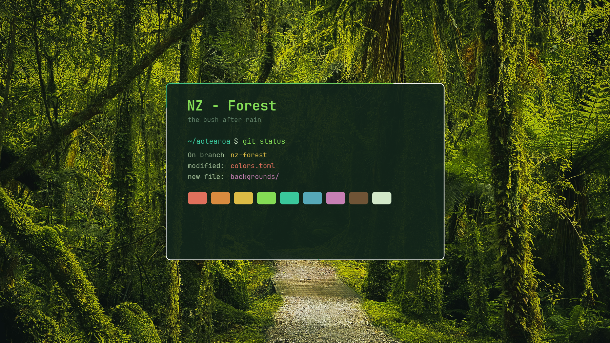

# NZ - Forest

A dark theme for [Omarchy](https://omarchy.org), drawn from the New Zealand bush
after rain.



The palette was sampled from the photographs themselves rather than invented:
wet leaf litter for the backgrounds, moss and new fern fronds for the accent,
lichen for text, and flowering natives for the ANSI colours. Every foreground
colour clears 5:1 contrast against the background, so terminal output stays
readable.

## Install

```bash
omarchy theme install https://github.com/Orrok/omarchy-nz-forest-theme.git
omarchy theme set "NZ Forest"
```

Omarchy strips the `omarchy-` prefix and `-theme` suffix from the repository
name, so the theme installs as `nz-forest`.

## What is in it

| File | Purpose |
|------|---------|
| `colors.toml` | The palette. Omarchy generates the terminal, editor, btop and shell themes from this. |
| `hyprland.lua` | Rounded corners, inactive-window dimming and a soft drop shadow. |
| `icons.theme` | Yaru Sage icon theme. |
| `chromium.theme` | Browser frame tint. |
| `unlock.png` | The Omarchy wordmark, recoloured to the accent. |
| `backgrounds/` | Ten photographs, every one 3840px wide or larger. |

Filenames in `backgrounds/` are zero-padded on purpose. Omarchy sorts them with
the locale's collation, which ignores hyphens, so an unpadded `10-` would sort
ahead of `1-` and the intended first wallpaper would never lead.

### The border gradient

`colors.toml` sets one optional key that does more work than the rest:

```toml
hyprland_active_border = "accent cyan 45deg"
```

Omarchy resolves those names against the palette and feeds the result into both
the Hyprland window border and every shell surface, so notifications, popups,
menus, the launcher and the lock screen all carry the same new-frond-to-pounamu
shift rather than a flat green.

### A note for anyone installing from this repository

Omarchy will not run code from a cloned theme, so it discards `hyprland.lua` on
install. The border gradient is deliberately defined in `colors.toml` instead,
which is never stripped, so it survives. What a cloned install loses is the
rounded corners, the inactive-window dimming and the drop shadow. Add them back
in your own `~/.config/hypr/looknfeel.lua`:

```lua
hl.config({
  decoration = {
    rounding = 10,
    dim_inactive = true,
    dim_strength = 0.15,
  },
})
```

This is a deliberate safety measure in Omarchy, not a fault in the theme.

## Photographs

The ten backgrounds are the work of eight photographers and are used under the
[Unsplash License](https://unsplash.com/license). Full attribution, including a
link to every photographer and every original photograph, is in
**[CREDITS.md](CREDITS.md)**. The same credit is embedded in each JPEG, so it
travels with the file.

Particular thanks to [Delphine Ducaruge](https://unsplash.com/@delphinenz),
whose West Coast boardwalk opens the rotation, and to
[Gaurav Kumar](https://unsplash.com/@countingframez), whose Kauaeranga Kauri
Trail series gave the theme its greens.

## Licence

Theme files are MIT, see [LICENSE](LICENSE). The photographs are not; they
belong to their photographers.
